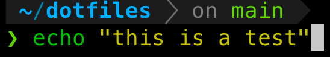

# dotfiles

dotlou's default dotfiles

## Higlights

- [powerline10k](https://github.com/romkatv/powerlevel10k)
  - Minimalist, dark, instant prompt
- [oh-my-zsh](https://github.com/ohmyzsh/ohmyzsh/)
  - [zsh-completions](https://github.com/zsh-users/zsh-completions)
  - [zsh-syntax-highlighting](https://github.com/zsh-users/zsh-syntax-highlighting)
  - [zsh-autosuggestions](https://github.com/zsh-users/zsh-autosuggestions)
- [thefuck](https://github.com/nvbn/thefuck)

